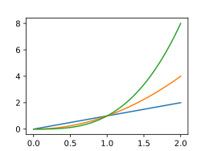
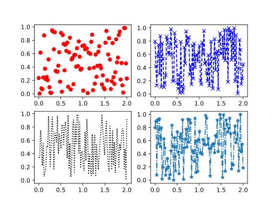

# Lab 01 - Wykresy w Python (`matplotlib`)

`Matplotlib` jest najpopularniejszą na dzień dzisiejszy biblioteką do tworzenia wykresów dla języka programowania `Python`. Składnię poleceń `matplotlib` zaprojektowano tak, aby przypominała tę znaną z `MATLAB`. `Matplotlib` jest w pełni kompatybilny z biblioteką numeryczną `NumPy` oraz `Pandas`.

W wcześniejszej części kursu korzystaliśmy z metody `plot()` obiektu typu `DataFrame`, która korzysta bezpośrednio z `matplotlib` i pozwala automatycznie tworzyć podstawowe i dobrze wyglądające wykresy. Jednakże, `matplotlib` pozwala na konfigurowanie w zasadzie każdego pojedynczego elementu wchodzącego w skład rysowanego obrazu, a dane do niego dostarczone niekoniecznie muszą pochodzić z `Pandas` - może to być macierz `NumPy` lub zwykła `Pythonowa` lista.

Pełna dokumentacja `matplotlib` wraz z przykładami i tutorialami dostępna  jest na stronie projektu: <https://matplotlib.org/>

Aby zacząć korzystać z `matplotlib` należy załączyć w odpowiedni sposób bibliotekę, zwyczajowo pod aliasem `plt`:

```python
import matplotlib.pyplot as plt
```

Pamiętaj, że żądany wykres nie wyświetli się dopóki nie wywołasz komendy:

```python
plt.show()
```

, wszystkie instrukcje `matplotlib` wywołane przed rysują wykres w tle. Wywołanie `show()` zatrzyma wykonywanie skryptu, aż do momentu zamknięcia okna z wykresem.

## *Figure* oraz *Axes*

W `matplotlib` istnieją dwa podstawowe pojęcia reprezentujące składowe rysowanego wykresu:

- *Figure* - cały obraz wykresu (okno), na którym rysowane są poszczególne wykresy, legendy, opisy itd. *Figure* możemy traktować jako płótno na którym będziemy rysować. Do danego *figure* może być przypisane wiele *axes*.

- *Axes* - reprezentuje osie danego wykresu i umieszczone w przestrzeni rysowania *figure*. Dany *figure* może zawierać wiele *axes* (często jest to tylko jeden zestaw osi rysowany w danym oknie), natomiast *axes* może być przypisane tylko do jednego *figure*.

Aby utworzyć pusty *figure*, bez *axes* należy wywołać:

```python
fig = plt.figure()
```

, gdzie zmienna `fig` będzie reprezentować obiekt całego okna wykresu.

### *Subplot*

W `matplotlib` przez pojęcie *subplot* rozumiany jest automatycznie utworzone *axes* w obrębie *figure*. Korzystanie z *subplot* ułatwia tworzenie wykresów, gdyż *axes* rozmieszczane są automatycznie w obrębie okna. Utworzenie najprostszego *figure* z pojedynczym umieszczonym na całym obszarze *axes* wykonujemy:

```python
fig, ax = plt.subplots()
```

, gdzie `fig` jest oknem wykresu, a `ax` reprezentuje osie rysowania wykresu (*axes*). Możliwe jest także szybkie utworzenie nowego *figure* z zdefiniowaną siatką wielu obszarów rysowania (*axes*), np.:

```python
fig, axs = plt.subplots(2, 2)
```

, gdzie `axs` jest macierzą obszarów rysowania (*axes*) w ramach zwróconego `fig`.

Pamiętaj, że wszystkie wykresy rysowane są w ramach *axes*, a nie w ramach *figure*. Wszystkie metody rysujące (np. `plot`, `scatter`) i większość metod modyfikujących wykres wywołujemy w ramach obiektu reprezentującego osie (obszar rysowania).

## `plot`

Podstawowym i najczęściej wykorzystywanym wykresem jest `plot`, który wyświetla wartości `y` względem wartości `x` jako linie lub jako punkty. Wielokrotne wywołanie funkcji rysującej w ramach danego *axes* powoduje wykreślenie wielu wykresów jeden na drugim:

```python
x = np.linspace(0, 2, 100)

fig, ax = plt.subplots()
ax.plot(x, x)
ax.plot(x, x**2)
ax.plot(x, x**3)
```



Jako pierwszy parametr podajemy wartości osi odciętych (*x*), jako drugi parametr osi rzędnych (*y*).

Często wykorzystywanym 3cim, nieobowiązkowym, parametrem jest ciąg formatujący wygląd wykresu, określa rodzaj markera, rodzaj linii oraz kolor. Format ciągu jest następujący `'[marker][linia][kolor]'`, pola nie są obowiązkowe, można wyspecyfikować tylko wybrane. Wybrane ciągi formatujące:

- marker:

|Znak|Opis|
|:-:|-|
|`'.'`|punkt|
|`'o'`|kółko|
|`'^'`|trójkąt|
|`'*'`|gwizdka|
|`'x'`|krzyżyk|
|...|...|

- linia

|Znak|Opis|
|:-:|-|
|`'-'`|linia ciągła|
|`'--'`|linia przerywana|
|`'-.'`|linia przerywana, kropkowana|
|`':'`|linia kropkowana|

- kolor

|Znak|Opis|
|:-:|-|
|`'b'`|niebieski|
|`'g'`|zielony|
|`'r'`|czerwony|
|`'c'`|cyjan|
|`'m'`|magenta|
|`'y'`|żółty|
|`'k'`|czarny|
|`'w'`|biały|

Przykładowo:

```python
x = np.linspace(0, 2, 100)

fig, axs = plt.subplots(2,2)
axs[0][0].plot(x, np.random.random(len(x)), 'or')
axs[0][1].plot(x, np.random.random(len(x)), 'x--b')
axs[1][0].plot(x, np.random.random(len(x)), ':k')
axs[1][1].plot(x, np.random.random(len(x)), '*-.')
```



Pełną listę modyfikatorów można znaleźć w dokumentacji metody `plot`: <https://matplotlib.org/api/_as_gen/matplotlib.pyplot.plot.html>

---

#### 🔥 Zadanie 1 🔥

Funkcja gęstości prawdopodobieństwa rozkładu normalnego ze średnią  μ i odchyleniem standardowym σ dana jest wzorem:

,

co możemy zapisać w Python jako:

```python
f = (1/(std_dev*np.sqrt(np.pi)))*np.exp((-(x-mean)**2)/(2*std_dev))
```

Korzystając z `matplotlib`, wygeneruj poniższy wykres:

,

---

## Opis wykresu

Każdy wykres aby być czytelny musi zostać dobrze opisany. Poniżej przedstawiono część metod dla *axes*, które pozwalają na łatwą modyfikację i opis zawartości wykresu.

### Tytuł

Do ustawienia tytułu pojedynczego wykresy (*axes*) korzystamy z metody `Axes.set_title`, np.:

```python
ax.set_title('Rozkład Gaussa', fontsize=16)
```

<https://matplotlib.org/api/_as_gen/matplotlib.axes.Axes.set_title.html>

W przypadku umieszczenia wielu *axes*, w jednym *figure*, może istnieć konieczność ustawienia głównego tytułu, za pomocą metody wykonywanej dla *figure* `suptitle`, np.:

```python
fig.suptitle('TYTUŁ')
```

<https://matplotlib.org/api/_as_gen/matplotlib.pyplot.suptitle.html>

uzyskując następujący efekt:


### Opisy osi

Opisy osi ustawiamy korzystając z:

- `Axes.set_xlabel` - <https://matplotlib.org/api/_as_gen/matplotlib.axes.Axes.set_xlabel.html>

- `Axes.set_ylabel` - 

### Legenda

### Ticks ?

---
Autorzy: *Tomasz Mańkowski*
