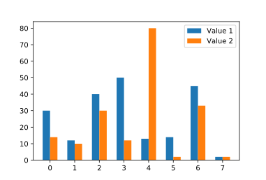
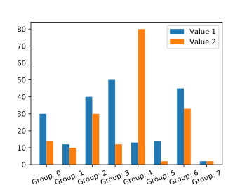
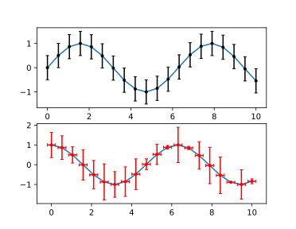

# Lab 03 - Wykresy w Python (`matplotlib`)

`Matplotlib` jest najpopularniejszą na dzień dzisiejszy biblioteką do tworzenia wykresów dla języka programowania `Python`. Składnię poleceń `matplotlib` zaprojektowano tak, aby przypominała tę znaną z `MATLAB`. `Matplotlib` jest w pełni kompatybilny z biblioteką numeryczną `NumPy` oraz `Pandas`.

W wcześniejszej części kursu korzystaliśmy z metody `plot()` obiektu typu `DataFrame`, która korzysta bezpośrednio z `matplotlib` i pozwala automatycznie tworzyć podstawowe i dobrze wyglądające wykresy. Jednakże, `matplotlib` pozwala na konfigurowanie w zasadzie każdego pojedynczego elementu wchodzącego w skład rysowanego obrazu, a dane do niego dostarczone niekoniecznie muszą pochodzić z `Pandas` - może to być macierz `NumPy` lub zwykła `Pythonowa` lista.

Pełna dokumentacja `matplotlib` wraz z przykładami i tutorialami dostępna  jest na stronie projektu: <https://matplotlib.org/>

Aby zacząć korzystać z `matplotlib` należy załączyć w odpowiedni sposób bibliotekę, zwyczajowo pod aliasem `plt`:

```python
import matplotlib.pyplot as plt
```

Pamiętaj, że żądany wykres nie wyświetli się dopóki nie wywołasz komendy:

```python
plt.show()
```

wszystkie instrukcje `matplotlib` wywołane przed rysują wykres w tle. Wywołanie `show()` zatrzyma wykonywanie skryptu, aż do momentu zamknięcia okna z wykresem.

## *Figure* oraz *Axes*

W `matplotlib` istnieją dwa podstawowe pojęcia reprezentujące składowe rysowanego wykresu:

- *Figure* - cały obraz wykresu (okno), na którym rysowane są poszczególne wykresy, legendy, opisy itd. *Figure* możemy traktować jako płótno na którym będziemy rysować. Do danego *figure* może być przypisane wiele *axes*.

- *Axes* - reprezentuje osie danego wykresu i umieszczone w przestrzeni rysowania *figure*. Dany *figure* może zawierać wiele *axes* (często jest to tylko jeden zestaw osi rysowany w danym oknie), natomiast *axes* może być przypisane tylko do jednego *figure*.

Aby utworzyć pusty *figure*, bez *axes* należy wywołać:

```python
fig = plt.figure()
```

gdzie zmienna `fig` będzie reprezentować obiekt całego okna wykresu.

### *Subplot*

W `matplotlib` przez pojęcie *subplot* rozumiany jest automatycznie utworzone *axes* w obrębie *figure*. Korzystanie z *subplot* ułatwia tworzenie wykresów, gdyż *axes* rozmieszczane są automatycznie w obrębie okna. Utworzenie najprostszego *figure* z pojedynczym umieszczonym na całym obszarze *axes* wykonujemy:

```python
fig, ax = plt.subplots()
```

gdzie `fig` jest oknem wykresu, a `ax` reprezentuje osie rysowania wykresu (*axes*). Możliwe jest także szybkie utworzenie nowego *figure* z zdefiniowaną siatką wielu obszarów rysowania (*axes*), np.:

```python
fig, axs = plt.subplots(2, 2)
```

gdzie `axs` jest macierzą obszarów rysowania (*axes*) w ramach zwróconego `fig`.

Pamiętaj, że wszystkie wykresy rysowane są w ramach *axes*, a nie w ramach *figure*. Wszystkie metody rysujące (np. `plot`, `scatter`) i większość metod modyfikujących wykres wywołujemy w ramach obiektu reprezentującego osie (obszar rysowania).

## `plot`

Podstawowym i najczęściej wykorzystywanym wykresem jest `plot` (<https://matplotlib.org/stable/api/_as_gen/matplotlib.pyplot.plot.html>), który wyświetla wartości `y` względem wartości `x` jako linie lub jako punkty. Wielokrotne wywołanie funkcji rysującej w ramach danego *axes* powoduje wykreślenie wielu wykresów jeden na drugim:

```python
x = np.linspace(0, 2, 100)

fig, ax = plt.subplots()
ax.plot(x, x)
ax.plot(x, x**2)
ax.plot(x, x**3)
```


Jako pierwszy parametr podajemy wartości osi odciętych (*x*), jako drugi parametr osi rzędnych (*y*).

Często wykorzystywanym trzecim, nieobowiązkowym, parametrem jest ciąg formatujący wygląd wykresu, określa rodzaj markera, rodzaj linii oraz kolor. Format ciągu jest następujący `'[marker][linia][kolor]'`, pola nie są obowiązkowe, można wyspecyfikować tylko wybrane. Wybrane ciągi formatujące:

- marker:

|Znak|Opis|
|:-:|-|
|`'.'`|punkt|
|`'o'`|kółko|
|`'^'`|trójkąt|
|`'*'`|gwizdka|
|`'x'`|krzyżyk|
|...|...|

- linia

|Znak|Opis|
|:-:|-|
|`'-'`|linia ciągła|
|`'--'`|linia przerywana|
|`'-.'`|linia przerywana, kropkowana|
|`':'`|linia kropkowana|

- kolor

|Znak|Opis|
|:-:|-|
|`'b'`|niebieski|
|`'g'`|zielony|
|`'r'`|czerwony|
|`'c'`|cyjan|
|`'m'`|magenta|
|`'y'`|żółty|
|`'k'`|czarny|
|`'w'`|biały|

Przykładowo:

```python
x = np.linspace(0, 2, 100)

fig, axs = plt.subplots(2,2)
axs[0][0].plot(x, np.random.random(len(x)), 'or')
axs[0][1].plot(x, np.random.random(len(x)), 'x--b')
axs[1][0].plot(x, np.random.random(len(x)), ':k')
axs[1][1].plot(x, np.random.random(len(x)), '*-.')
```


Pełną listę modyfikatorów można znaleźć w dokumentacji metody `plot`: <https://matplotlib.org/stable/api/_as_gen/matplotlib.pyplot.plot.html>

---

#### 🔥 Zadanie 1 🔥 

Funkcja gęstości prawdopodobieństwa rozkładu normalnego ze średnią  μ i odchyleniem standardowym σ dana jest wzorem:

,

co możemy zapisać w Python jako:

```python
f = (1/(std_dev*np.sqrt(np.pi)))*np.exp((-(x-mean)**2)/(2*std_dev))
```

Korzystając z `matplotlib`, wygeneruj poniższy wykres:

,

---

## Opis wykresu

Każdy wykres aby być czytelny musi zostać dobrze opisany. Poniżej przedstawiono część metod dla *axes*, które pozwalają na łatwą modyfikację i opis zawartości wykresu.

### Tytuł

Do ustawienia tytułu pojedynczego wykresy (*axes*) korzystamy z metody `Axes.set_title`, np.:

```python
ax.set_title('Rozkład Gaussa', fontsize=16)
```

<https://matplotlib.org/stable/api/_as_gen/matplotlib.axes.Axes.set_title.html>

W przypadku umieszczenia wielu *axes*, w jednym *figure*, może istnieć konieczność ustawienia głównego tytułu, za pomocą metody wykonywanej dla *figure* `suptitle`, np.:

```python
fig.suptitle('TYTUŁ')
```

<https://matplotlib.org/stable/api/_as_gen/matplotlib.pyplot.suptitle.html>

uzyskując następujący efekt:


### Opisy osi

Opisy osi ustawiamy korzystając z:

- `Axes.set_xlabel` - <https://matplotlib.org/stable/api/_as_gen/matplotlib.axes.Axes.set_xlabel.html>
- `Axes.set_ylabel` - <https://matplotlib.org/stable/api/_as_gen/matplotlib.axes.Axes.set_ylabel.html>

### Legenda

W celu umieszczenia na danym wykresie (*axes*) legendy opisujące poszczególne linie wykresu korzystamy z metody `Axes.legend`, gdzie jako parametr podajemy listę napisów, np.:

```python
ax.legend(['Opis 1', 'Opis 2', 'Opis 3'])
```

Legenda jest w pełni konfigurowalna, pełną listę opcji znajdziemy w dokumentacji: <https://matplotlib.org/stable/api/_as_gen/matplotlib.axes.Axes.legend.html>

Warto zwrócić uwagę na parametr `loc` pozwalający umieścić legendę w innej lokalizacji, niż ta wygenerowana automatycznie. Parametr `loc` przyjmuje następujące wartości:

- `'best'`
- `'upper right'`
- `'upper left'`
- `'lower left'`
- `'lower right'`
- `'right'`
- `'center left'`
- `'center right'`
- `'lower center'`
- `'upper center'`
- `'center'`

### Siatka

Do załączenia siatki na wykresie używamy metody `Axes.grid`: <https://matplotlib.org/stable/api/_as_gen/matplotlib.axes.Axes.grid.html>. Warto zwrócić uwagę, że w przypadku bardziej zaawansowanych scenariuszy można wykorzystać dwa poziomy gęstości siatki: *major* (główna) i *minor* (pomocnicza)

### Zakresy osi

Istnieje możliwość ustawienia zakresu osi. Korzystamy z:

- `Axes.set_xlim` - <https://matplotlib.org/stable/api/_as_gen/matplotlib.axes.Axes.set_xlim.html>
- `Axes.set_ylim` - <https://matplotlib.org/stable/api/_as_gen/matplotlib.axes.Axes.set_ylim.html>

Często wykorzystujemy tę możliwość, gdy chcemy ograniczyć zakres aktualnego wyświetlania wykresu, lub kiedy automatycznie wygenerowany zakres nie jest satysfakcjonujący. Zwróć uwagę, że wykres rozkładu prawdopodobieństwa wykonany w ramach wcześniejszego zadania kończy się na około 0.58, przestawienie zakresu wyświetlania na <0, 1> zwiększy czytelność prezentowanych danych:

```python
ax.set_ylim(0, 1)
```

### Etykiety osi

Zmiana etykiet osi może być konieczna gdy chcemy na przykład zwiększyć lub zmniejszyć liczebność wyświetlanych etykiet (ich gęstość), lub gdy automatycznie wygenerowane etykiety nie spełniają naszych oczekiwań. Korzystamy z:

- `Axes.set_xticks` - <https://matplotlib.org/stable/api/_as_gen/matplotlib.axes.Axes.set_xticks.html>
- `Axes.set_yticks` - <https://matplotlib.org/stable/api/_as_gen/matplotlib.axes.Axes.set_yticks.html>

W przypadku wykresu rozkładu prawdopodobieństwa z wcześniejszego zadania etykiety osi X zostały wygenerowane w zakresie <-4, 4>. Ponieważ dane wejściowe dla osi X są z zakresu <-5, 5) lepszą czytelność uzyskamy ustawiając taki właśnie zakres:

```python
ax.set_xticks(np.arange(-5, 6, 1))
```

Metody ustawiające etykiety osi posiadają parametr `minor` domyślnie ustawiony na `False`, przekazując do powyższych metod wartość parametru `True` zamiast ustawiać główne etykiety osi, ustawiamy etykiety pomocnicze, np.:

```python
ax.set_xticks(np.arange(-5, 5, 0.5), minor=True)
```

Różnicę pomiędzy etykietami głównymi, a pomocniczymi przedstawiono na poniższym rysunku:


Wygląd etykiet możemy modyfikować korzystając z metody `Axes.tick_params` - <https://matplotlib.org/stable/api/_as_gen/matplotlib.axes.Axes.tick_params.html>, możliwa jest na przykład zmiana orientacji, koloru, czy wielkości wygenerowanych etykiet.

---

#### 🔥 Zadanie 2 🔥 

Korzystając z powyższych instrukcji zmodyfikuj wykres z poprzedniego zadania, tak aby nadać mu następujący wygląd:


---

<!-- ## `Scatter`

`Scatter` (<https://matplotlib.org/stable/api/_as_gen/matplotlib.pyplot.scatter.html>) jest rodzajem wykresu, zbliżonym do `plot`, z tą różnicą że w jego przypadku mamy możliwość zdefiniowania rozmiaru i koloru każdego z punktu. Otrzymujemy w ten sposób trzeci wymiar informacji prezentowany na 2-wymiarowym wykresie. -->

## `bar`

`bar` (<https://matplotlib.org/stable/api/_as_gen/matplotlib.pyplot.bar.html>) pozwala utworzyć wykres słupkowy. Każdy słupek umieszczany jest w punkcie określony listą/macierzą `x`, posiada wysokość i szerokość określoną przez `height` i `width`. Np.:

```python
fig, ax = plt.subplots()

values = [30, 12, 40, 50, 13, 14, 45, 2]
x = np.arange(len(values))
width = 0.8

ax.bar(x, values, width)
```


### Grupowanie wykresów słupkowych

W bardzo prosty sposób możemy na jednym wykresie umieścić wiele wykresów słupkowych, które reprezentować będą dodatkowy, trzeci wymiar informacji na naszym wykresie. Przygotowując taki wykres należy zwrócić uwagę, na rozmieszczenie słupków w osi `x`, musimy wziąć pod uwagę szerokość rysowanego słupka i odpowiednio przesunąć punkt jego rysowania, np.:

```python
fig, ax = plt.subplots()

values1 = [30, 12, 40, 50, 13, 14, 45, 2]
values2 = [14, 10, 30, 12, 80, 2, 33, 2]
x = np.arange(len(values1))
width = 0.3

ax.bar(x-width/2, values1, width, label='Value 1')
ax.bar(x+width/2, values2, width, label='Value 2')

ax.legend()
```



## Tekstowe etykiety osi

`matplotlib` daje możliwość nadpisania liczbowych etykiet za pomocą ciągów znaków, tak aby wprowadzić bardziej czytelny opis. Szczególnie sprawdza się to w połączeniu z wykresami słupkowymi. Do utworzenia opisów tekstowych służy metoda `Axes.set_xticklabels` (<https://matplotlib.org/stable/api/_as_gen/matplotlib.axes.Axes.set_xticklabels.html>) i `Axes.set_yticklabels` (<https://matplotlib.org/stable/api/_as_gen/matplotlib.axes.Axes.set_yticklabels.html>).

**UWAGA:** `Axes.set_xticklabels` powinna zostać zawsze poprzedzona wywołaniem metody `Axes.set_xticks`, która ustali rozmieszczenie etykiet, w przeciwnym wypadku opisy mogą trafić w nieokreślone miejsce na osi `x`. Podobnie w przypadku `Axes.set_yticklabels`.

Przykładowa modyfikacja wykresu z przedstawionego wyżej:

```python
labels = ['Group: ' + str(i) for i in range(len(values1))]

ax.set_xticks(x)
ax.set_xticklabels(labels)

ax.tick_params(axis='x', labelrotation=20)
```



---

#### 🔥 Zadanie 3 🔥 

Dany jest plik w formacie JSON, zamierający informacje o procencie osób, które przeżyły raka w populacji USA (324 mln) według płci i wieku w 2016 roku: [cancer_survival_in_us.json](_resources/lab_03/cancer_survival_in_us.json) (źródło: <https://cebp.aacrjournals.org/content/25/7/1029>).

Korzystając z wczytanych danych wygeneruj poniższy wykres:


**PODPOWIEDŹ:** w przypadku problemu z siatką rysowaną na wykresie, użyj polecenia: `ax.set_axisbelow(True)`.

---

## `errorbar`

`errorbar` (<https://matplotlib.org/stable/api/_as_gen/matplotlib.pyplot.errorbar.html>) pozwala w bardzo prosty sposób wygenerować paski błędów, które często wykorzystywane są do prezentacji niepewności pomiarowej, odchylenia/wariancji przedstawionych na wykresie danych. `errorbar` jest niezależnym wykresem i można go stosować z każdym innym wykresem, w tym z `plot` i `bar`.

Jako parametry `errorbar` przyjmuje wektory położeń `x` i `y` znaczników, oraz ich rozmiar w kierunku osi x i y: `xerr` oraz `yerr`. Pominięcie jedno z parametrów rozmiaru znacznika spowoduje wykreślenie pasków błędów tylko w jednej osi. Zależnie od formatu przekazanych parametrów `xerr` i `yerr` paski błędów będą przyjmować następujące konfiguracje:

- skalar - symetryczne wartości +/- takie same dla wszystkich punktów,
- wektor długości N - symetryczne wartości +/-,
- macierz 2xN - oddzielne wartości + i - dla wszystkich punktów,
- brak - brak paska błędu.

Do formatowania wyglądu `errorbar` wykorzystywany jest parametr `fmt`, przyjmuje on taki sam string formatujący jak funkcja `plot`. Warto zwrócić uwagę na parametr `capsize`, którego ustawienie spowoduje wygenerowanie charakterystycznych dla pasków błędów "daszków". Np.:

```python
x = np.linspace(0, 10, 20)
y_sin = np.sin(x)
y_cos = np.cos(x)

fig, axs = plt.subplots(2, 1)

axs[0].plot(x, y_sin)
axs[0].errorbar(x, y_sin, yerr=0.5, fmt='.k', capsize=2)

axs[1].plot(x, y_cos)
axs[1].errorbar(x, y_cos, xerr=0.2, yerr=np.random.random(len(x)), fmt='.r', capsize=2)
```



---

#### 🔥 Zadanie 4 🔥 

Do wykresu słupkowego z poprzedniego zadania dodaj paski błędów, zarówno dla wykresu reprezentującego mężczyzn, jak i kobiety. Pamiętaj, że w przypadku tego wykresu błąd może występować tylko w osi y. Wartości błędów wylosuj. Przykład formatowania:


---

## `hist`

Funkcja `hist` (<https://matplotlib.org/stable/api/_as_gen/matplotlib.pyplot.hist.html>) automatycznie, bez pisania dodatkowego kodu, oblicza histogram danych wejściowych i go wykreśla. Jako parametr podajemy dane wejściowe `x`, oraz określamy liczebność zakresów `bins`. `bins` może być także wektorem, jeżeli chcemy ręcznie określić zakresy. Ustawienie parametru `density` na `True` powoduje wykreślenie histogramu gęstości prawdopodobieństwa. Przykładowo:

```python
x1 = np.random.randn(10000)
x2 = np.random.rand(10000)

fig, axs = plt.subplots(1, 2)
axs[0].hist(x1, 20, density=True, facecolor='g')
axs[1].hist(x2, 20, density=True, facecolor='r')
```


#### 🔥 Zadanie 5 🔥 

Wczytaj plik: [wyniki głosowania w wyborach prezydenckich w Rosji 2024](https://chmura.put.poznan.pl/s/rsiPjNy7rtej9C2) 

1. Zapoznaj się z kolumnami tego zbioru.
2. wyświetl histogram procentowej liczby głosów za aktualnie urzędującym prezydentem. 
3. Zmień liczbę binów na histogramie na 500. Czy można zaobserwować anomali takie jak w roku 2020 (patrz wykład lub [zbiór z roku 2020](https://chmura.put.poznan.pl/s/TSaazB8DHn5TIEi))
<!--
4. Stwórz w wczytanym dataframe nową kolumnę zawierająca względną liczbę głosów za aktualnie urzędującym prezydentem. Jest to iloraz wartości  liczby głosów za (kolumna `yes`) do liczby głosów oddanych (kolumna `given`)
5. Wyświetl histogram względnej liczby głosów za dla domyślnych ustawień
6. Zmień liczbę binów histogramu na 100. Czy możesz zauważyć jakieś anomalie? -->
   
---

Autorzy: *Tomasz Mańkowski, Piotr Kaczmarek*
