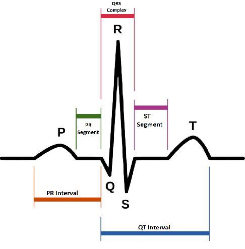

# Lab 04 - Grupowanie danych, tabele przestawne i wektoryzacja

## Wprowadzenie
### Grupowanie danych `DataFrame.groupby(..)`
Metoda `groupby` pozwala na wykonanie agregacji danych które posiadają taką samą wartość wskazanych kolumn, po zgrupowaniu można zastosować dowolną funkcję/funkcje agregujące (np. wyznaczyć statystykę: wartość średnią, medianę lub wartości maksymalną czy minimalną).


Do agregacji można używać pojedynczej funkcji:
np.
``` python
df.groupby('color').mean()
```
lub wielu funkcji:
``` python
df.groupby('color').agg(['mean','count'])
```
Pamiętaj, że mean, median, sum, min i max mogą zostać wyznaczone  wyłącznie dla zmiennych liczbowych (min,max również dla zmiennych porządkowych).
Dla wszystkich zmiennych w tym nominalnych działają metody count, first, last

### 🔥 Zadanie 1 🔥 

Wczytaj [dane temperatur](https://chmura.put.poznan.pl/s/WuUUiklnK9CHnU0) i wyznacz średnią temperaturę, minimalną i maksymalną temperaturę w danym regionie. Następnie wyznacz te same wskazania dla poszczególnych miesięcy. 


### Multiindex
Grupowanie tworzy hierarchiczną strukturę indexów (multiindex). Dla tego typu danych nadal można wybierać poszczególne rekordy stosując metodę `.loc` podając wartość indeksu jako krotkę. 
np. Dla DataFrame z zadania 1:


wybranie temperatury dla Afryki i Europy w roku 2015 ma formę:
``` python
    df.loc[(['Europe', 'Africa'], 2015),:]
```
Jeśli natomiast interesuje nas wybór po elementach z niższego indeksu i wszystkich elementów z wyższego indeksu dla indeksu dla którego chcemy użyć wszystkie elementy należy wpisać `slice(None)`. np żeby wybrać temperatury z Afryki z grudnia ze wszystkich lat:
``` python
df.loc[('Africa', slice(None),12),:]
```

W Pandas możliwe jest usunięcie multiindexów i stworzenie z nich standardowych kolumn:
```python
df.reset_index()
```

### Tabele przestawne (pivot table)
Tabele przestawne umożliwiają "przestawianie danych", np. dla analizowanego w datasetach przykładach pozwalają nie tylko na agregację danych ale również na stworzenie nowych kolumn, po których dokonano grupowania. Przeanalizuj wynik działania następującego kodu:
``` python 
df = data.drop(columns=['Day']).pivot_table(columns='Region', index=['Year','Month'], aggfunc=['min', 'max', 'mean'], values='AvgTemperature' )
```

Efektem jest stworzenie tabeli przestawnej zawierającej statystyki  (`aggfunc`) - (min, max, mean) dla wszystkich regionów (`columns`), i zgrupowanych po roku i miesiącu (`index`).
Powyższa funkcja robi to samo co kod w zadaniu 1, jednak dodatkowo index regionów rozdziela na kolumny.

**Uwaga**: użycie `.loc` do wybierania kolumn w konfiguracji hierarchicznej (multi-column) odbywa się identycznie jak w przypadku multiindexów.

### 🔥 Zadanie 2 🔥 

Dla datasetu z zadania 1 wyznacz temperatury w grudniu i czerwcu dla wszystkich regionów. Na 2 subplotach (czerwiec/grudzień) wyświetl w formie wykresu liniowego zmiany temperatur w latach obserwacji dla poszczególnych regionów, czy łatwiej ten wykres wygenerować dla tabeli przestawnej czy dla datasetu z zadania 1?

### Wektoryzacja
Wektoryzacja to technika przetwarzania danych, która polega na zastosowaniu operacji na całych kolumnach (lub wierszach) zamiast na pojedynczych elementach. W Pandas operacje na kolumnach są wektoryzowane, co oznacza, że można je stosować do całych kolumn jednocześnie.
Przeanalizuj poniższy kod, który wyznacza wartość średnią fragmentu sygnału triggerowanego przez zdarzenie:):
``` python
signal_example = np.random.rand(10000)  # Example of a signal

# Generate example event timestamps
event_timestamps = np.sort(np.random.randint(1000, 9000, 20))  # Example event timestamps

# Create a time window around each event (e.g., -200 ms to 200 ms)
window_start = -0.2  # Start 200 ms before the event
window_end = 0.2  # End 200 ms after the event

# Create a time vector representing the time points for the analysis
sample_rate = 1000  # Example sampling rate (1 kHz)
time_vector = np.linspace(window_start, window_end, int((window_end - window_start) * sample_rate) + 1)

# Use NumPy vectorized operations to extract segments around each event
segments = signal_example[(event_timestamps[:, np.newaxis] + sample_rate * time_vector).astype(int)]

# Compute the average signal across all segments using vectorized operations
average_signal = np.mean(segments, axis=0)
```

### 🔥 Zadanie 3🔥

Wczytaj i wyświetl [sygnał ECG](_resources/lab_04/raw_ecg.csv) oraz chwile w których wykryto załamki R [beatTimestamps](_resources/lab_04/ecg_beats.csv). Czas wystąpienia załamka R podawany jest jako index próbki.

Wiedząc, że częstotliwość próbkowania wynosi 500Hz, wyznacza wartość średnią fali ecg w przedziale (-550ms; 400ms) względem wykrytych załamków R. Dla uśrednionego przebiegu zmierz  wartość amplitudy załamka P, R, i T, oraz interwał Q-T. Sposób pomiaru przedstawiono na rysunku poniżej.



### 🔥 Zadanie 4 - końcowe🔥 
Wczytaj dataset zawierający informacje o [pasażerach Titanica](https://chmura.put.poznan.pl/s/iTFzgANpoh6zkeB).
1. Używając grupowania lub tabeli przestawnej spróbuj stworzyć dataset zawierający informację o liczbie osób które przeżyły katastrofę z podziałem na płeć i klasę w której podróżowały
2. Wyznacz udział  procentowy osób, które przeżyły z uwzględnieniem płci i klasy biletu
3. Wyniki z pkt 2 wyświetl w formie wykresu słupkowego, gdzie bary pogrupowane są wg płci a w obrębie grupy przedstawiony jest procentowa przeżywalność w poszczególnych klasach. Pamiętaj żeby wykres opatrzony był legendą.


---
Autorzy: *Piotr Kaczmarek*
