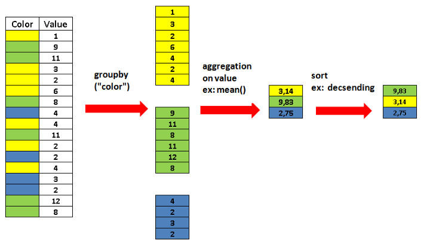
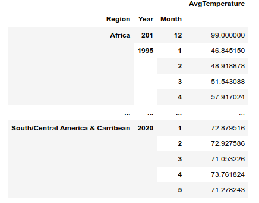

# Lab 04 - Grupowanie danych i tabele przestawne

## Wprowadzenie
### Grupowanie danych `DataFrame.groupby(..)`
Metoda `groupby` pozwala na wykonanie agregacji danych które posiadają taką samą wartość wskazanych kolumn, po zgrupowaniu można zastosować dowolną funkcję/funkcje agregujące (np. wyznaczyć statystykę: wartość średnią, medianę lub wartości maksymalną czy minimalną).


Do agregacji można używać pojedynczej funkcji:
np.
``` python
df.groupby('color').mean()
```
lub wielu funkcji:
``` python
df.groupby('color').agg(['mean','count'])
```
Pamiętaj, że mean, median, sum, min i max mogą zostać wyznaczone  wyłącznie dla zmiennych liczbowych (min,max również dla zmiennych porządkowych).
Dla wszystkich zmiennych w tym nominalnych działają metody count, first, last

### 🔥 Zadanie 1 🔥 

Wczytaj [dane temperatur]() i wyznacz średnią temperaturę, minimalną i maksymalną temperaturę w danym regionie. Następnie wyznacz te same wskazania dla poszczególnych miesięcy. 


### Multiindex
Grupowanie tworzy hierarchiczną strukturę indexów (multindex). Dla tego typu danych nadal można wybierać poszczególne rekordy stosując metodę `.loc` podając wartość indeksu jako krotkę. 
np. Dla DataFrame z zadania 1:


wybranie temperatury dla Afryki i Europy będzie w roku 2015 miało postać:
``` python
    df.loc[(['Europe', 'Africa'], 2015),:]
```
Jeśli natomiast interesuje nas wybór po elementach z niższego indeksu i wszystkich elementów z wyższego indeksu dla indeksu dla którego chcemy użyć wszystkie elementy należy wpisać `slice(None)`. np żeby wybrać temperatury z Afryki z grudnia ze wszystkich lat:
``` python
df.loc[('Africa', slice(None),12),:]
```

W Pandas możliwe jest usunięcie multiindexów i stworzenie z nich standardowych kolumn:
```python
df.reset_index()
```

### Tabele przestawne (pivot table)
Tabele przestawne umożliwiają "przestawianie danych", np. dla analizowanego w datasetach przykładach pozwalają nie tylko na agregację danych ale również na stworzenie nowych kolumn, po których dokonano grupowania. Przeanalizuj wynik działania następującego kodu:
``` python 
df = data.drop(columns=['Day']).pivot_table(columns='Region', index=['Year','Month'], aggfunc=['min', 'max', 'mean'], values='AvgTemperature' )
```

Efektem jest stworzenie tabeli przestawnej zawierającej statystyki  (`aggfunc`) - (min, max, mean) dla wszystkich regionów (`columns`), i zgrupowanych po roku i miesiącu (`index`).
Powyższa funkcja robi to samo co kod w zadaniu 1, jednak dodatkowo index regionów rozdziela na kolumny.

**Uwaga**: użycie `.loc` do wybierania kolumn w konfiguracji hierarchicznej (multi-column) odbywa się identycznie jak w przypadku multiindexów.

### 🔥 Zadanie 2 🔥 

Dla datasetu z zadania 1 wyznacz temperatury w grudniu i czerwcu dla wszystkich regionów. Na 2 subplotach (czerwiec/grudzień) wyświetl w formie wykresu liniowego zmiany temperatur w latach obserwacji dla poszczególnych regionów, czy łątwiej ten wykres wygenerować dla tabeli przestawnej czy dla datasetu z zadania 1?


### 🔥 Zadanie 3 🔥 
Wczytaj dataset zawierający informacje o [pasażerach Titanica](titanic_train.csv).
1. Używając grupowania lub tabeli przestawnej spróbuj stworzyć dataset zawierający informację o liczbie osób które przeżyły katastrofę z podziałem na płeć i klasę, w której podróżowały
2. Wyznacz udział  procentowy osób, które przeżyły z uwzględnieniem płci i klasy biletu 
3. Wyniki z pkt 2 wyświetl w formie wykresu słupkowego, gdzie bary podgrupowane są wg płci a w obrębie grupy przedstawiony jest procentowa przeżywalność w poszczególnych klasach. Pamiętaj żeby wykres opatrzony był legendą.


---
Autorzy: *Piotr Kaczmarek*
