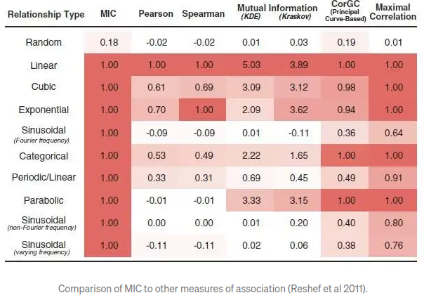

# Lab 06 - Analiza i wstępne przetwarzanie danych
<!-- <-- https://www.kaggle.com/pmarcelino/comprehensive-data-exploration-with-python> -->

## Wprowadzenie
Przedmiotowe zajęcia wykorzystują [zbiór danych](https://www.kaggle.com/c/house-prices-advanced-regression-techniques/data), lub [alternatywny link](https://chmura.put.poznan.pl/s/yEjnsKCyvcUn7A9). Zbiór zawiera informację o cenach sprzedaży nieruchomości oraz ich cechy. Zapoznaj się z opisem poszczególnych kolumn.  W EAD chodzi o zrozumienie zależności między cechami w tym dla przedmiotowego datasetu zależności między cechami a ceną sprzedaży. 

### Macierz korelacja a metryki podobieństwa
Macierz korealacji jest dość popularnym sposobem analizy  zależności między poszczególnymi parami cech. Najbardziej powszechni stosowana korelacja Pearsona (`df.corr()`)  umożliwia wykrycie relacji z silnym komponentem liniowym, w przypadku niektórych typów nieliniowości można stosować metody bazujące na korelacji rozkładu (korelacje Spearmana (`df.corr('spearman')`)) 

Wykrycie bardziej złożonych zależności może nie być możliwe. W praktyce stosowane są również inne metody umożliwiające ocenę zależności między poszczególnymi cechami:


- [MIC](https://medium.com/@rhondenewint93/on-maximal-information-coefficient-a-modern-approach-for-finding-associations-in-large-data-sets-ba8c36ebb96b) (maximal information coefficient) pozwala na mapowanie zależności o charakterze wielomianowym lub harmonicznym. Macierz podobieństwa jest symetryczna.
- [PPS](https://towardsdatascience.com/rip-correlation-introducing-the-predictive-power-score-3d90808b9598) (predictive power score). Podobieństwo jest określona na podstawie znormalizowanej metryki określającej dokładność modelu opartego o regresor drzewiasty testowanego z wykorzystaniem k-krotnej walidacji. Konsekwencją jest otrzymanie niesymetrycznej macierzy podobieństwa (dana cech A (np. nazwa miasta) może być  estymowana na podstawie cechy B (kod pocztowy), jednak odwrócenie tego procesu jest niemożliwe)
PPS w implementacji pythona stosuje encoder stąd analiza dotyczy również cech nominalnych. W dalszej części zajęć próbujesz zastosować tą metodą w celu porównania z macierzą korelacji.
``` python
import ppscore as pps
pps_mat = pps.matrix(df_train)
pps_mat = pps_mat[['x', 'y', 'ppscore']].pivot(columns='x', index='y', values='ppscore')
```  

### Przebieg ćwiczenia

Podczas laboratorium spróbuj uruchomić i przyswoić sobie metodykę analizy części cech zaprezentowaną w [notatniku](https://www.kaggle.com/code/pmarcelino/comprehensive-data-exploration-with-python). Klikając przycisk `Copy and Edit` możesz uruchamiać poszczególne sekcje i modyfikować ich działanie. Spróbuj zrozumieć logikę procesu eksploracji który obejmuje:

1. Analizę poszczególnych zmiennych, usuwanie outlierów
   
2. Analizę zależności między zmiennymi w formie wykresu punktowego, analizy współczynnika korelacji
   
3. Analizę rozkładów poszczególnych zmiennych, oraz porównanie go z standardowymi rozkładami (np. normalnym) lub rozkładami innych zmiennych.
   
4. W końcowym etapie analiza może zakończyć się wnioskami dotyczącymi istotności poszczególnych zmiennych oraz relacji między nimi.

### Dalsze działania
Po przeanalizowaniu zawartości notatnika spróbuj wprowadzić następujące zmiany:

1. Zmodyfikuj procedurę usuwającą outliery. W tym celu dla sekcji `Out liars->Univariant analysis` wyświetl zawartość kolumny `SalesPrice` jako box plot. 
   
2. Dokonaj usunięcia outlierów traktując jako outliery elementy znajdujące się poza zakresem  `<Q1 - 1.5*IRQ, Q3 + 1.5*IRQ>`, gdzie `IRQ=Q3-Q1`. Do wyznaczenia wartości kwartyli wykorzystaj metodę `DataFrame.quantile(q=q)`, gdzie `q` jest wartością kwantyla (dla `Q1` wynosi 0.25, dla `Q3` 0.75) 
   
3. Popraw procedurę usuwania odstających wartości w sekcji `Bivariate analysis` tak żeby indeksy wartości odstających były określane przez podanie zakresu odczytanego z wykresu. Spróbuj znaleźć zmienne dla których pojawia się podobne zjawisko
   
4. Przeanalizuj kolumnę `2ndFlrSF` określ z jakimi innymi cechami jest silnie (korelacja >0.6) skorelowana.
   
5. Zastanów się i spróbuj uzasadnić czy warto do klasyfikacji wykorzystać równocześnie cechy `1stFlrSF` i `TotalBsmtSF`
   
6. Zamiast macierzy korelacji wykorzystaj metodę analizy opartą o Predictive Power Score
   
7. Wybierając cechy numeryczne i nominalne spróbuj ocenić dokładność klasyfikacji przy pomocy lasu drzew. Wybierz 2 zestawy cech bazując na macierzy korelacji i metodzie PPS. Zastanów się czy w wynikach metody PPS, jeśli celem jest predykcja ceny to czy brać pod uwagę wyniki w wierszu czy kolumnie?. Pamiętaj żeby wykorzystać zbiór uczący i testowy, a parametry preprocessingu wyznaczone dla zbioru uczącego zastosować dla zbioru testowego (bez ich ponownego liczenia)
<!-- 8. Na podstawie własnej analizy i przekształceń wybierz 4 cechy, które twoim zdaniem będą najlepiej reprezentowały cenę i stosując metodę z poprzednich zajęć (las drzew) spróbuj ocenić dokładność klasyfikacji i porównać ją z pkt 7. Pamiętaj, że dla zbioru testowego należy przeprowadzić te same procedury przetwarzania, z tym, że np. wyznaczone dla zbioru uczącego zakresy kwartyli i IRQ, wyznaczony model normalizacji, należy zastosować bezpośrednio na zbiorze testowym bez ponownego wyznaczania wartości. -->

<!-- ### Analiza wartości 0
Traktowanie wartości '0' jako brakującej.
   - Ile jest elementów, które mają cenę sprzedaży równą 0?
   - Przeanalizuje przykładowe wiersze i zastanów się z czego to wynika
   - Dla elementów z ceną '0' Wyświetl wykres `scatter` i przeanalizuje czy istnieje korelacja między tymi elementami 
   - czy ich usunięcie wpłynie na poprawę jakości klasyfikacji? -->
---
Autor: *Piotr Kaczmarek*