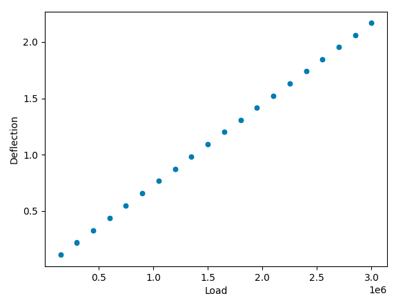
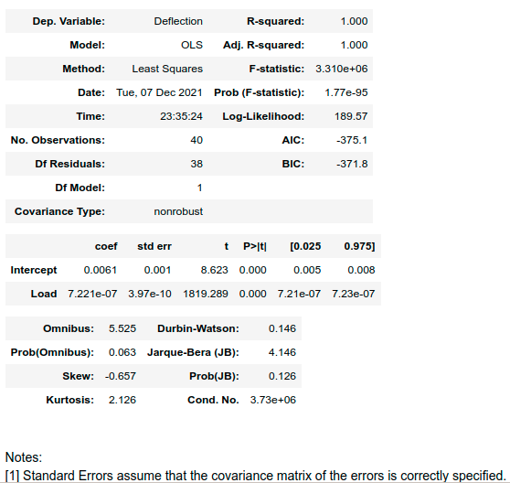
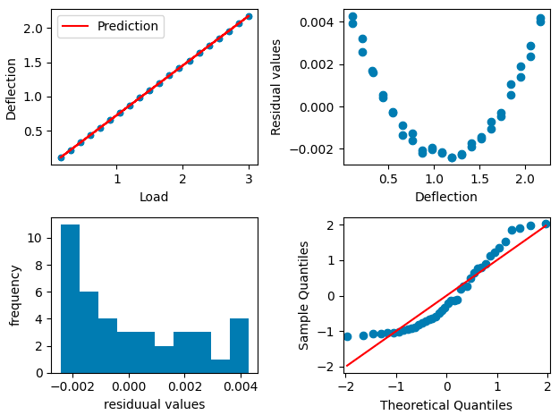

# Lab 07 - Modelowanie danych
<!-- <-- https://www.kaggle.com/pmarcelino/comprehensive-data-exploration-with-python> -->
<script src='https://cdnjs.cloudflare.com/ajax/libs/mathjax/2.7.4/MathJax.js?config=default'></script>

## Wprowadzenie
Celem zajęć jest przedstawienie procedury budowy modelu opartego o analizę danych, który pozwala wyjaśnić relacje między nimi. Zasadniczo dla danych ciągłych model taki jest regresorem opisanym przez regresję liniową lub nieliniową. 

W przykładowej analizie realizowanej w ramach wprowadzenia  będzie wykorzystywany [zbiór danych](./_resources/lab_07a/deflection.csv). Zawierający dane z eksperymentu obciążania belki zmienną siłą, podczas którego rejestrowano ugięcie belki. Dane mają postać:



### Regresja liniowa dla jednej zmiennej
Z otrzymanego wykresu możemy stwierdzić, że model opisujący zależność między obciążeniem a ugięciem jest modelem liniowym
$$D_{deflection} = a \cdot X_{load} + b$$ 

Współczynniki takiego modelu mogą być wyznaczone przy pomocy regresji liniowej. Do wyznaczenia regresji można użyc wielu różnych modułów: `scipy.stats.linregress`, `sklearn.linear_model.LinearRegression`,jednak na zajęciach będziemy wykorzystywali funkcję `statsmodels.formula.api.ols`, który dobrze integruje się z `pandas` i poza wyznaczeniem współczynników modelu pozwala na wyznaczenie również statystyk dotyczących istotności otrzymanych wyników oraz przedziałów ufności dla parametrów.

```python
from statsmodels.formula.api import ols
model = ols('Deflection ~ Load', data=data)
res = model.fit()
res.summary()
```
model opisany jest w stylu języka `R` więcej informacji na temat definiowania modeli, które mogą być zarówno liniowe jak nieliniowe, obejmować zmienne kategoryczne i ciągłe, można znaleźć w [dokumentacji](https://www.statsmodels.org/dev/example_formulas.html)

Efekt dopasowania można wyświetlić używając metody `predict`, lub tworząc wyrażenie zawierające wyestymowane współczynniki:
data['Prediction'] = model.predict(data)

ax = data.plot.scatter(x='Load',y='Deflection', ax=axs[0,0])

### Analiza wyników faza 1
wynikiem metody `res.summary()` jest następujący zbiór danych: 

Warto zwrócić uwagę na następujące metryki:
- `R-squared` (R2) - [współczynnik determinacji](https://pl.wikipedia.org/wiki/Wsp%C3%B3%C5%82czynnik_determinacji), wyrażony jako iloraz wariancji wyników predykowanych z modelu do wariancji wyników rzeczywistych. Jest jedną z najpopularniejszych metryk opisujących dopasowanie modelu do danych, gdy ma wartość 1, oznacza to bardzo dobre dopasowanie inne wartości wskazują na rozbieżności w dopasowania, ma wartość 0, gdy model zwraca wartość średnią. Otrzymana wartość wskazuje na bardzo dobre dopasowanie modelu do danych. Aktualnie dokładniejszymi metrykami są AIC i BIC. 
 
- `coef` - kolumna zawiera wyestymowane współczynniki regresji dla obciążenia (`Load`) i skłądową stałą (`intercept`), kolejne kolumn zwiarają błąd standardowy współczynnika (`std err`), prawdopodobieństwo testowe (`P`) oraz przedział ufności dla poziomu ufności 0.95
- `Omnibus test`, `Prob(Omnibus)` - statystyki pozwalające określić na ile zaproponowany model jest w stanie zmniejszyć wariancję błędu (residuów). Statystyka (F-test)  jest wykorzystywana w teście ANOVA i będzie omawiana na kolejnych zajęciach. Na chwilę obecną można stwierdzić, że Prob(Omnibus) wskazuje, że jest 6.3% szans że dopasowany model w pełni wyjaśnia wariancję 


Mogłoby się wydawać, że otrzymane są bardzo dobre poza wynikiem testu Omnibus, który może wskazywać na to że występują inne, nieuwzględnione w modelu zależności.
``` python
fig, axs = plt.subplots(2,2, squeeze=False)
data['Prediction'] = model.predict(data)
plt.tight_layout()

ax = data.plot.scatter(x='Load',y='Deflection', ax=axs[0,0])
data.plot(x='Load',y='Prediction', ax=axs[0,0], color='red')
# plt.subplot(2,2,2)
residuals = model.predict(data)-data['Deflection']
axs[0,1].scatter(data['Load'], (residuals))
axs[0,1].set_xlabel('Load')
axs[0,1].set_ylabel('Residual values')

axs[1,0].hist(residuals)
axs[1,0].set_ylabel('frequency')
axs[1,0].set_xlabel('residuual values')
plt.subplot(2,2,4)
sm.qqplot(residuals, stats.t, distargs=(4,), loc=3, scale=10, fit=True, ax=axs[1,1], line='s')
plt.tight_layout()
```

a efektem jest wykres:

wynikiem metody `res.summary()` jest następujący zbiór danych: 

Z analizy residuów widać, że błąd dopasowania ma charakter systematyczny a nie przypadkowy, co potwierdza wynik testu Omnibus. 
Również histogram nie ma rozkładu normalnego, co miałoby miejsce, gdyby elementem, którego nie może wyjaśnić model jest szum biały. Z Q-Q plot można również ocenić że residuua nie mają rozkładu normalnego.
### Poprawa modelu
Poprawa modelu odbywa się głównie przez analizę residuów. W tym przypadku można przypuszczać, że brakujący człon ma jest zbliżony do paraboli. 

W przypadku regresji liniowej, człon wykładniczy możemy zrealizować przez dodanie kolejnej zmiennej która jest kwadratem zmiennej wejściowej:

Model będzie miał więc postać:
```python
data['Load2'] = data['Load']**2
model = ols('Deflection ~ Load + Load2', data=data)
res = model.fit()
```

Przeanalizuj wyniki i sprawdź jak rozszerzenie modelu wpłynęło na wartości statytsyk, wartości parametrów modelu oraz na przedział ufności poszczególnych parametrów. Szczególną uwagę zwróć na Omnibus test.


## Dalsze działania
W poniższych zadaniach wykorzystaj dane z zeszłych zajęć ([zbiór danych](https://www.kaggle.com/c/house-prices-advanced-regression-techniques/data), lub [alternatywny link](https://chmura.put.poznan.pl/s/yEjnsKCyvcUn7A9)), oraz stworzone wtedy kody służące do wczytywania i czyszczenia danych.

1. Spróbuj postępując zgodnie z przedstawioną metodą wyznaczyć model dla relacji między ceną sprzedaży nieruchomości (`SalePrice`) a `GrLivArea`
2.  Spróbuj postępując zgodnie z przedstawioną metodą wyznaczyć model dla relacji między ceną sprzedaży nieruchomości (`SalePrice`) a `OverallQual` 3. 
3. Spróbuj wyznaczyć model który  jest połączeniem modelu 1 i 2 oraz dodatkowo zawiera dane dotyczące i `TotalBsmtSF` (model powinien być sumą etykiet poszczególnych kolumn)
4. Dla każdego modelu oceń jak zmienia się wariancji wartości residuów oraz statystyki. Czy model 3 dał istotną poprawę jakości dopasowanie, zmniejszył wariancję?
5. Na podstawie własnej analizy z poprzednich zajęć wybierz 4 cechy, które twoim zdaniem będą najlepiej reprezentowały cenę i stosując metodę z poprzednich zajęć (las drzew) spróbuj ocenić dokładność regresji w porównaniu z wynikami modeli 1,2,3. W tym celu wyznacz wartość R2 (do tego celu możesz wykorzystać `from sklearn.metrics import r2_score`, lub zaimplementować odpowiednie wyrażenie zgodnie ze wzorem)

<!-- ### Analiza wartości 0
Traktowanie wartości '0' jako brakującej.
   - Ile jest elementów, które mają cenę sprzedaży równą 0?
   - Przeanalizuje przykładowe wiersze i zastanów się z czego to wynika
   - Dla elementów z ceną '0' Wyświetl wykres `scatter` i przeanalizuje czy istnieje korelacja między tymi elementami 
   - czy ich usunięcie wpłynie na poprawę jakości klasyfikacji? -->
---
Autorzy: *Piotr Kaczmarek*
