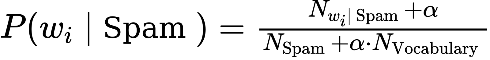
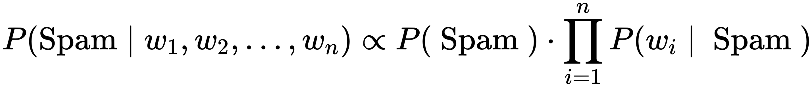

# Lab 12 - Operacje na tekście i naiwny Algorytm Bayesa (naive Bayes)

## Dataset

Dataset zawiera zestaw krótkich wiadomości tekstowych (sms), który został poetykietowany jako `spam` i `ham`. Zestaw pochodzi z [bazy UCI](https://archive.ics.uci.edu/ml/datasets/sms+spam+collection) i można go pobrać z  [SMSSpamCollection](_resources/lab_12/SMSSpamCollection.bin)

```python
import pandas as pd
import numpy as np
from bs4 import BeautifulSoup
import re
import nltk

sms_data = pd.read_csv('SMSSpamCollection', header=None, sep='\t', names=['Label', 'SMS'])
```

W bazie są 2 kolumny oznaczane jako `Label` i `SMS`

## Czyszczenie tekstu
Ponieważ podejście do klasyfikacji oparte o model Bayesa polega na wyznaczeniu prawdopodobieństwa przynależności danej wiadomości do spamu, pod warunkiem, że znane są prawdopodobieństwa warunkowe poszczególnych wyrazów. W związku z tym wyrazy powinny zostać zunifikowane (zredukowane do korpusu, zamienione na małe litery), ponadto powinny zostać usunięte znaki interpunkcyjne i inne wartości, które nie są wyrazami.

```python
def prep(string):
    
    # Remove HTML tags.
    string = BeautifulSoup(string,'html.parser').get_text()
    
    # Remove non-letters
    string = re.sub("[^a-zA-Z]", " ", string)
    
    # Lower case
    string = string.lower()
    
    # Tokenize to each word.
    token = nltk.word_tokenize(string)
    
    # Stemming
    string = [nltk.stem.SnowballStemmer('english').stem(w) for w in token]
    
    # Join the words back into one string separated by space, and return the result.
    return string
```
Zastosowanie powyższej funkcji do jednego wiersza może mieć postać:
``` python
sms_data['SMS'].iloc[:1].apply(prep).iloc[0]

```

Stwórz nowa kolumnę i zapisz do niej przetransformowaną zawartość wiadomości tekstowych:
``` python
sms_data['clean_sms'] =....
```

## Algorytm Bayesa
Na początku dokonajmy podziału na część która zostanie wykorzystana do stworzenia modelu (zbiór uczący) i zbiór testowy:

```python 
train_data = sms_data.sample(frac=0.8,random_state=1).reset_index(drop=True)
test_data = sms_data.drop(train_data.index).reset_index(drop=True)
train_data = train_data.reset_index(drop=True)
```

Prawdopodobieństwo przynależności wiadomości do zbioru spamu i hamu, oraz liczbę wyrazów odpowiednio w zbiorze spamu i hamu można wyznaczyć jako:

``` python
Pspam = train_data['Label'].value_counts()['spam'] / train_data.shape[0]
Pham = train_data['Label'].value_counts()['ham'] / train_data.shape[0]
Nvoc = len(train_data.columns) - 3 #całkowita liczba unikalnych wyrazów
Nspam = train_data.loc[train_data['Label'] == 'spam', 'clean_sms'].apply(len).sum() #liczba wyrazów we wiadomościach typu spam
Nham = train_data.loc[train_data['Label'] == 'ham', 'clean_sms'].apply(len).sum() #liczba wyrazów we wiadomościach typu ham
```

Stworzenie słownika unikalnych wyrazów, można zrealizować za pomocą drzewa binarnego (`set`):
``` python
vocabulary = list(set(train_data['clean_sms'].sum()))
```

zmienna `vocabulary` opisuje przestrzeń wektora cech, gdzie każdą współrzędną jest osobny wyraz. W takiej przestrzeni dla każdego wpisu wyznaczany jest wektor cech `word_count_per_sms`, a następnie scalany z zbiorem danych:
``` python
word_counts_per_sms = pd.DataFrame([
    [row[1].count(word) for word in vocabulary]
    for _, row in train_data.iterrows()], columns=vocabulary)
train_data = pd.concat([train_data.reset_index(), word_counts_per_sms], axis=1).iloc[:,1:]
``` 

Zakładając że train_data jest zbiorem obserwacji definiującym model Bayesa prawdopodobieństwo warunkowe przynależności danego elementu do zbioru spamu opisuje funkcja:



gdzie N_wi|spam oznacza liczbę wystąpień danego wyrazu we wiadomościach typu spam, N_spam oznacza całkowitą liczbę wyrazów we wiadomościach typu spam. Alpha jest współczynnikiem, który ma znaczenie gdy dany wyraz nie występuje  w modelu, wtedy, przyjmowane jest, że prawdopodobieństwo wystąpienia dla spamu i hamu są równe i wynoszą 1/N_vocabulary/

Implementacja funkcji może mieć formę:
``` python
def p_w_spam(word, alpha=1):
    if word in train_data.columns[4:]:
        return (train_data.loc[train_data['Label'] == 'spam', word].sum() + alpha) / (Nspam + alpha*Nvoc)
    else:
        return 1
```
Napisz funkcję `p_w_ham` wyznaczającą prawdopodobieństwo wystąpienia wyrazu pod warunkiem, że sms należy do zbioru ham.
``` python
def p_w_ham(word):
    # do zdefiniowania
```

prawdopodobieństwo warunkowe tego że dana wiadomość jest spamem (Posterior probability) opisane jest twierdzeniem Bayesa:


Bazując na wzorze oraz na szkielecie napisz funkcję, która dokonuje klasyfikacji wiadomości:

```python
def classify(message):
    p_spam_given_message = Pspam
    p_ham_given_message = Pham
    for word in message:
        p_spam_given_message  = ... # Do zaimplementowania
        p_ham_given_message = ... # Do zaimplementowania
    if p_ham_given_message > p_spam_given_message:
        return 'ham'
    elif p_ham_given_message < p_spam_given_message:
        return 'spam'
    else:
        return 'unknown'
```
Dokonaj klasyfikacji wiadomości:

```python
test_data['predicted'] = test_data['clean_sms'].apply(classify)
```

Skuteczność klasyfikacji możesz sprawdzić zliczając ilośc prawidłowych klasyfikacji.

```python
correct = (test_data['predicted'] == test_data['Label']).sum() / test_data.shape[0] * 100
```

Pytania:
1. Jaka jest dokładność klasyfikatora
2. Które wyrazy mają (top 10) najwyższe prawdopodobieństwo tego że wchodzą w skład wiadomości typu spam
3. Które wiadomość należące do spamu (top 3) mają najwyższe prawdopodobieństwo że są spamem?


---
Autorzy: *Piotr Kaczmarek*  i *Jakub Tomczyński*
