# Lab 05 - Czyszczenie danych

Celem czyszczenia danych jest:
- wykrycie elementów brakujących i ich uzupełnienie lub usunięcie wierszy
- konwersja danych (np daty) i typów nominalnych (w tym korekta błędów w nazwach elementów np. poznań, Poznan, Pznan, Poznań)
- analiza rozkładów i usunięcie elementów odstających (outlierów)
- normalizacja danych i normalizacja rozkładu

## Elementy brakujące
1. Wczytaj zbiór danych z  do zmiennej ``df``
2. Wyznaczanie liczbę wartości brakujących (pustych) i przeanalizuj w jakich kolumnach występują braki
```Python
missing_values_count = df.isnull().sum()
```
3. Podejście 1: usunięcie kolumn/wierzy zawierających przynajmniej 1 element pusty - przetestuj oba podejścia:
```Python
df_cleaned_rows = df.dropna()
df_cleaned_cols = df.dropna(axis=1)
```
- Zastanów się które z tych podejść powinno być zastosowane jeśli chcemy stworzyć klasyfikator predykujący ceny nieruchomości?
- czy wiesz które wiersze zostały usunięte?
- sprawdź dokumentację [dropna](https://pandas.pydata.org/pandas-docs/stable/reference/api/pandas.DataFrame.dropna.html) i zobacz:
  -  w jaki sposób usunąć tylko wiersze z jeśli wartości puste są w kolumnie ``BuildingArea``, 
  -  ograniczając liczbę wierszy sprawdź ile zostanie wierszy jeśli usunie się wiersze, które nie mają równocześnie wypełnionego pola ``BuildingArea`` i  ``YearBuilt``
4. Podejście 2: wypełnienie pustych wartości np. zerami lub wartością która poprzedza wartość brakującą
``` Python
df_cleaned_zeros = df.fillna(0) # wypełnia zerami
df_cleaned_bfill = df.fillna(method='bfill', axis=0).fillna(0) #wypełnia wartością poprzedzającą z kolumny, jeśli to niemożliwe, wstawia 0
```
- Zastanów się kiedy takie podejście może być stosowane, czy można je użyć do klasyfikacji?, sprawdź w dokumentacji [fillna](https://pandas.pydata.org/pandas-docs/stable/reference/api/pandas.DataFrame.fillna.html) jakie są jeszcze możliwości wypełnienia wypełnienia?


5. Podejście 3: podstawienie wartości średniej/mediany/mody:
``` Python
from sklearn.impute import SimpleImputer
imp_mean = SimpleImputer(missing_values=np.nan, strategy='mean') 
df_numeric = df.select_dtypes(include=[np.number]).copy()#wybór tylko kolumn przechowujacych liczby, należy wykonać kopię obiektu
df_numeric.loc[:] = imp_mean.fit_transform(df_numeric)#estymacja wartości średniej kolumn i wypełnienie wartości pustych
df_mean_imp = df.copy() #kopia obiektu inaczej operacje bedą na oryginale
df_mean_imp.update(df_numeric) #uaktualnienie wartości liczbowych  w pełnej tabeli
```
- kiedy wypełnianie wartością sąsiednią ma sens? Jeśli stosujemy je do klasyfikacji to jaką strategię przyjąć w odniesieniu do brakujących wartości referencyjnych a jaką w odniesieniu do brakujących cech?
## Konwersja danych


## Usunięcie elementów odstających


## Normalizacja

---

#### 🔥 Zadanie 1 🔥

Funkcja gęstości prawdopodobieństwa rozkładu normalnego ze średnią  μ i odchyleniem standardowym σ dana jest wzorem:

,

co możemy zapisać w Python jako:

```python
f = (1/(std_dev*np.sqrt(np.pi)))*np.exp((-(x-mean)**2)/(2*std_dev))
```

Korzystając z `matplotlib`, wygeneruj poniższy wykres:

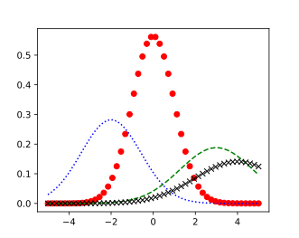,

---

## Opis wykresu

Każdy wykres aby być czytelny musi zostać dobrze opisany. Poniżej przedstawiono część metod dla *axes*, które pozwalają na łatwą modyfikację i opis zawartości wykresu.

### Tytuł

Do ustawienia tytułu pojedynczego wykresy (*axes*) korzystamy z metody `Axes.set_title`, np.:

```python
ax.set_title('Rozkład Gaussa', fontsize=16)
```

<https://matplotlib.org/api/_as_gen/matplotlib.axes.Axes.set_title.html>

W przypadku umieszczenia wielu *axes*, w jednym *figure*, może istnieć konieczność ustawienia głównego tytułu, za pomocą metody wykonywanej dla *figure* `suptitle`, np.:

```python
fig.suptitle('TYTUŁ')
```

<https://matplotlib.org/api/_as_gen/matplotlib.pyplot.suptitle.html>

uzyskując następujący efekt:

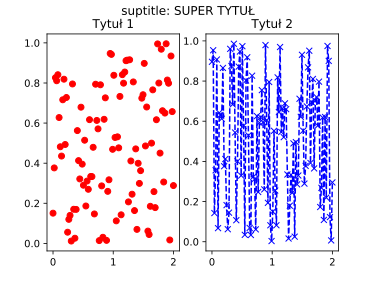

### Opisy osi

Opisy osi ustawiamy korzystając z:

- `Axes.set_xlabel` - <https://matplotlib.org/api/_as_gen/matplotlib.axes.Axes.set_xlabel.html>
- `Axes.set_ylabel` - <https://matplotlib.org/api/_as_gen/matplotlib.axes.Axes.set_ylabel.html>

### Legenda

W celu umieszczenia na danym wykresie (*axes*) legendy opisujące poszczególne linie wykresu korzystamy z metody `Axes.legend`, gdzie jako parametr podajemy listę napisów, np.:

```python
ax.legend(['Opis 1', 'Opis 2', 'Opis 3'])
```

Legenda jest w pełni konfigurowalna, pełną listę opcji znajdziemy w dokumentacji: <https://matplotlib.org/api/_as_gen/matplotlib.axes.Axes.legend.html>

Warto zwrócić uwagę na parametr `loc` pozwalający umieścić legendę w innej lokalizacji, niż ta wygenerowana automatycznie. Parametr `loc` przyjmuje następujące wartości:

- `'best'`
- `'upper right'`
- `'upper left'`
- `'lower left'`
- `'lower right'`
- `'right'`
- `'center left'`
- `'center right'`
- `'lower center'`
- `'upper center'`
- `'center'`

### Siatka

Do załączenia siatki na wykresie używamy metody `Axes.grid`: <https://matplotlib.org/api/_as_gen/matplotlib.axes.Axes.grid.html>. Warto zwrócić uwagę, że w przypadku bardziej zaawansowanych scenariuszy można wykorzystać dwa poziomy gęstości siatki: *major* (główna) i *minor* (pomocnicza)

### Zakresy osi

Istnieje możliwość ustawienia zakresu osi. Korzystamy z:

- `Axes.set_xlim` - <https://matplotlib.org/api/_as_gen/matplotlib.axes.Axes.set_xlim.html>
- `Axes.set_ylim` - <https://matplotlib.org/api/_as_gen/matplotlib.axes.Axes.set_ylim.html>

Często wykorzystujemy tę możliwość, gdy chcemy ograniczyć zakres aktualnego wyświetlania wykresu, lub kiedy automatycznie wygenerowany zakres nie jest satysfakcjonujący. Zwróć uwagę, że wykres rozkładu prawdopodobieństwa wykonany w ramach wcześniejszego zadania kończy się na około 0.58, przestawienie zakresu wyświetlania na <0, 1> zwiększy czytelność prezentowanych danych:

```python
ax.set_ylim(0, 1)
```

### Etykiety osi

Zmiana etykiet osi może być konieczna gdy chcemy na przykład zwiększyć lub zmniejszyć liczebność wyświetlanych etykiet (ich gęstość), lub gdy automatycznie wygenerowane etykiety nie spełniają naszych oczekiwań. Korzystamy z:

- `Axes.set_xticks` - <https://matplotlib.org/api/_as_gen/matplotlib.axes.Axes.set_xticks.html>
- `Axes.set_yticks` - <https://matplotlib.org/api/_as_gen/matplotlib.axes.Axes.set_yticks.html>

W przypadku wykresu rozkładu prawdopodobieństwa z wcześniejszego zadania etykiety osi X zostały wygenerowane w zakresie <-4, 4>. Ponieważ dane wejściowe dla osi X są z zakresu <-5, 5) lepszą czytelność uzyskamy ustawiając taki właśnie zakres:

```python
ax.set_xticks(np.arange(-5, 6, 1))
```

Metody ustawiające etykiety osi posiadają parametr `minor` domyślnie ustawiony na `False`, przekazując do powyższych metod wartość parametru `True` zamiast ustawiać główne etykiety osi, ustawiamy etykiety pomocnicze, np.:

```python
ax.set_xticks(np.arange(-5, 5, 0.5), minor=True)
```

Różnicę pomiędzy etykietami głównymi, a pomocniczymi przedstawiono na poniższym rysunku:

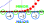

Wygląd etykiet możemy modyfikować korzystając z metody `Axes.tick_params` - <https://matplotlib.org/api/_as_gen/matplotlib.axes.Axes.tick_params.html>, możliwa jest na przykład zmiana orientacji, koloru, czy wielkości wygenerowanych etykiet.

---

#### 🔥 Zadanie 2 🔥

Korzystając z powyższych instrukcji zmodyfikuj wykres z poprzedniego zadania, tak aby nadać mu następujący wygląd:

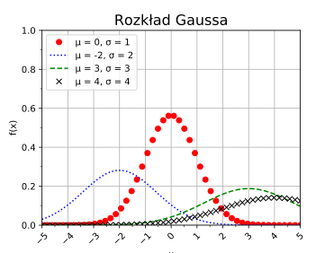

---

<!-- ## `Scatter`

`Scatter` (<https://matplotlib.org/api/_as_gen/matplotlib.pyplot.scatter.html>) jest rodzajem wykresu, zbliżonym do `plot`, z tą różnicą że w jego przypadku mamy możliwość zdefiniowania rozmiaru i koloru każdego z punktu. Otrzymujemy w ten sposób trzeci wymiar informacji prezentowany na 2-wymiarowym wykresie. -->

## `bar`

`bar` (<https://matplotlib.org/api/_as_gen/matplotlib.pyplot.bar.html>) pozwala utworzyć wykres słupkowy. Każdy słupek umieszczany jest w punkcie określony listą/macierzą `x`, posiada wysokość i szerokość określoną przez `height` i `width`. Np.:

```python
fig, ax = plt.subplots()

values = [30, 12, 40, 50, 13, 14, 45, 2]
x = np.arange(len(values))
width = 0.8

ax.bar(x, values, width)
```

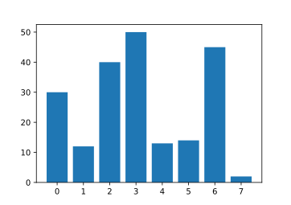

### Grupowanie wykresów słupkowych

W bardzo prosty sposób możemy na jednym wykresie umieścić wiele wykresów słupkowych, które reprezentować będą dodatkowy, trzeci wymiar informacji na naszym wykresie. Przygotowując taki wykres należy zwrócić uwagę, na rozmieszczenie słupków w osi `x`, musimy wziąć pod uwagę szerokość rysowanego słupka i odpowiednio przesunąć punkt jego rysowania, np.:

```python
fig, ax = plt.subplots()

values1 = [30, 12, 40, 50, 13, 14, 45, 2]
values2 = [14, 10, 30, 12, 80, 2, 33, 2]
x = np.arange(len(values1))
width = 0.3

ax.bar(x-width/2, values1, width, label='Value 1')
ax.bar(x+width/2, values2, width, label='Value 2')

ax.legend()
```

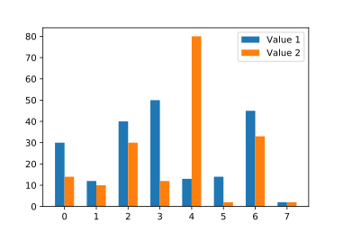

## Tekstowe etykiety osi

`matplotlib` daje możliwość nadpisania liczbowych etykiet za pomocą ciągów znaków, tak aby wprowadzić bardziej czytelny opis. Szczególnie sprawdza się to w połączeniu z wykresami słupkowymi. Do utworzenia opisów tekstowych służy metoda `Axes.set_xticklabels` (<https://matplotlib.org/api/_as_gen/matplotlib.axes.Axes.set_xticklabels.html>) i `Axes.set_yticklabels` (<https://matplotlib.org/api/_as_gen/matplotlib.axes.Axes.set_yticklabels.html>).

**UWAGA:** `Axes.set_xticklabels` powinna zostać zawsze poprzedzona wywołaniem metody `Axes.set_xticks`, która ustali rozmieszczenie etykiet, w przeciwnym wypadku opisy mogą trafić w nieokreślone miejsce na osi `x`. Podobnie w przypadku `Axes.set_yticklabels`.

Przykładowa modyfikacja wykresu z przedstawionego wyżej:

```python
labels = ['Group: ' + str(i) for i in range(len(values1))]

ax.set_xticks(x)
ax.set_xticklabels(labels)

ax.tick_params(axis='x', labelrotation=20)
```

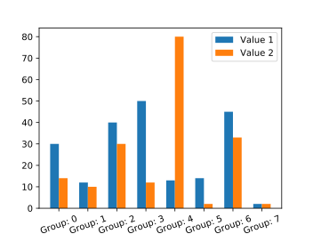

---

#### 🔥 Zadanie 3 🔥

Dany jest plik w formacie JSON, zamierający informacje o procencie osób, które przeżyły raka w populacji USA (324 mln) według płci i wieku w 2016 roku: [cancer_survival_in_us.json](_resources/lab_03/cancer_survival_in_us.json) (źródło: <https://cebp.aacrjournals.org/content/25/7/1029>).

Korzystając z wczytanych danych wygeneruj poniższy wykres:

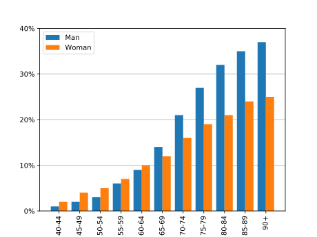

**PODPOWIEDŹ:** w przypadku problemu z siatką rysowaną na wykresie, użyj polecenia: `ax.set_axisbelow(True)`.

---

## `errorbar`

`errorbar` (<https://matplotlib.org/api/_as_gen/matplotlib.pyplot.errorbar.html>) pozwala w bardzo prosty sposób wygenerować paski błędów, które często wykorzystywane są do prezentacji niepewności pomiarowej, odchylenia/wariancji przedstawionych na wykresie danych. `errorbar` jest niezależnym wykresem i można go stosować z każdym innym wykresem, w tym z `plot` i `bar`.

Jako parametry `errorbar` przyjmuje wektory położeń `x` i `y` znaczników, oraz ich rozmiar w kierunku osi x i y: `xerr` oraz `yerr`. Pominięcie jedno z parametrów rozmiaru znacznika spowoduje wykreślenie pasków błędów tylko w jednej osi. Zależnie od formatu przekazanych parametrów `xerr` i `yerr` paski błędów będą przyjmować następujące konfiguracje:

- skalar - symetryczne wartości +/- takie same dla wszystkich punktów,
- wektor długości N - symetryczne wartości +/-,
- macierz 2xN - oddzielne wartości + i - dla wszystkich punktów,
- brak - brak paska błędu.

Do formatowania wyglądu `errorbar` wykorzystywany jest parametr `fmt`, przyjmuje on taki sam string formatujący jak funkcja `plot`. Warto zwrócić uwagę na parametr `capsize`, którego ustawienie spowoduje wygenerowanie charakterystycznych dla pasków błędów "daszków". Np.:

```python
x = np.linspace(0, 10, 20)
y_sin = np.sin(x)
y_cos = np.cos(x)

fig, axs = plt.subplots(2, 1)

axs[0].plot(x, y_sin)
axs[0].errorbar(x, y_sin, yerr=0.5, fmt='.k', capsize=2)

axs[1].plot(x, y_cos)
axs[1].errorbar(x, y_cos, xerr=0.2, yerr=np.random.random(len(x)), fmt='.r', capsize=2)
```

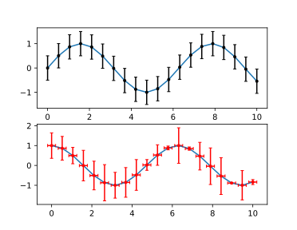

---

#### 🔥 Zadanie 4 🔥

Do wykresu słupkowego z poprzedniego zadania dodaj paski błędów, zarówno dla wykresu reprezentującego mężczyzn, jak i kobiety. Pamiętaj, że w przypadku tego wykresu błąd może występować tylko w osi y. Wartości błędów wylosuj. Przykład formatowania:

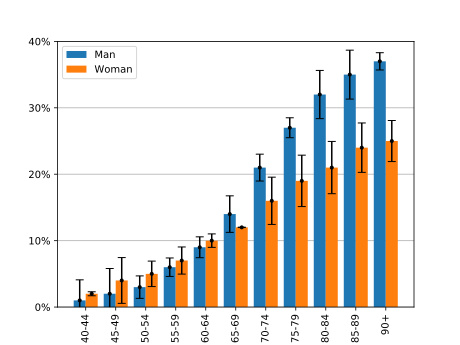

---

## `hist`

Funkcja `hist` (<https://matplotlib.org/api/_as_gen/matplotlib.pyplot.hist.html>) automatycznie, bez pisania dodatkowego kodu, oblicza histogram danych wejściowych i go wykreśla. Jako parametr podajemy dane wejściowe `x`, oraz określamy liczebność zakresów `bins`. `bins` może być także wektorem, jeżeli chcemy ręcznie określić zakresy. Ustawienie parametru `density` na `True` powoduje wykreślenie histogramu gęstości prawdopodobieństwa. Przykładowo:

```python
x1 = np.random.randn(10000)
x2 = np.random.rand(10000)

fig, axs = plt.subplots(1, 2)
axs[0].hist(x1, 20, density=True, facecolor='g')
axs[1].hist(x2, 20, density=True, facecolor='r')
```

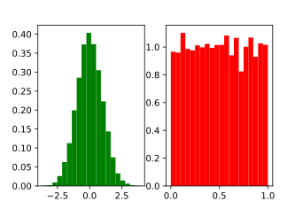


---
Autorzy: *Tomasz Mańkowski*
