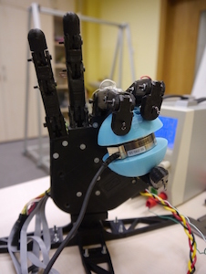

# Lab 10 - Wybór cech i redukcja wymiarowości zbiorów (część 1)

## Dataset

Na zajęciach wykorzystywany będzie dość popularny zbiór zawierający informację o cechach morfologicznych 3 różnych gatunków irysów (setosa, versicolor, virginica), dla których mierzone były 4 cechy: szerokość i wysokość pręcików i płatków .

Więcej na ten temat możesz znaleźć w [wiki](https://en.wikipedia.org/wiki/Iris_flower_data_set)

Plik z bazą można pobrać tutaj: [iris.csv](_resources/lab_10/iris.csv)

```python
import pandas as pd
import matplotlib.pyplot as plt
import seaborn as sns

iris = pd.read_csv('./iris.csv')
sns.pairplot(iris, hue="variety")
```

Przeanalizuj strukturę zbioru danych oraz `pairplot`.

Jakie wnioski/spostrzeżenia dotyczące rozkładu danych możesz wskazać?

## Macierz korelacji

Wyznacz macierz korelacji i przeanalizuj zależności między poszczególnymi parametrami. Określ, które z nich są najsilniej/najsłabiej ze sobą związane i umożliwiają najlepszą separację gatunków?

```python
ax = sns.heatmap(iris.corr(), annot=True)
```

Czy jesteś w stanie, bazując na macierzy korelacji i wykresach par cech, wskazać cechy, które warto byłoby wybrać do klasyfikacji (które są liniowo separowalne?)

Spróbuj wybrać 1 i 2 cechy i porównaj wynik klasyfikacji z wynikiem uzyskanym dla wszystkich cech.

W celu oceny możesz użyć następującego kodu wykorzystującego do klasyfikacji liniową analizę dyskryminacyjną (LDA):
```python
import numpy as np

from sklearn.model_selection import cross_val_score
from sklearn.model_selection import RepeatedStratifiedKFold
from sklearn.discriminant_analysis import LinearDiscriminantAnalysis

model = LinearDiscriminantAnalysis()

cv = RepeatedStratifiedKFold(n_splits=10, n_repeats=3, random_state=1)

scores = cross_val_score(model, iris[['sepal.length', 'sepal.width', 'petal.length', 'petal.width']], iris['variety'], scoring='accuracy', cv=cv, n_jobs=-1)

print(f"Mean Accuracy: {np.mean(scores)} ({np.std(scores)})")
```
Jaka jest różnica? Czy jest możliwe, że dla zbioru złożonego z jednej cechy uzyskamy większą dokładność niż dla zbioru złożonego z 2 cech? Spróbuj uzasadnić zaobserwowane efekty.


## Analiza składowych głównych (PCA)

Dokonaj przekształcenia zbioru danych metodą analizy składowych głównych. Więcej na ten temat możesz znaleźć w materiałach z wykładu.
Wyznaczenie składowych głównych polega na wyznaczeniu macierzy rotacji w przestrzeni cech, która maksymalizuje wariancję wzdłuż kolejnych składowych.

Transformację PCA możesz wykonać realizując następujący kod:

```python
from sklearn.preprocessing import StandardScaler
from sklearn.decomposition import PCA

scaler = StandardScaler()
x = scaler.fit_transform(x)

pca = PCA()
x_pca = pca.fit_transform(x)

iris_pca = pd.DataFrame(data=x_pca)
iris_pca['variety'] = iris['variety']
```

1. Spróbuj zaobserwować co zmieniło się w macierzy korelacji oraz w wykresie par cech?
2. Przeanalizuj zmienną `pca.components_` zawierającą macierz rotacji. Pamiętaj, że po wyznaczeniu parametrów transformacji PCA, możesz ją zrealizować mnożąc macierz cech przez macierz rotacji: `np.transpose(pca.components_@np.transpose(X))` lub wywołując metodę `pca.transform(X)`
3. Przeanalizuj zdolność wyjaśniającą każdej ze składowych: `pca.explained_variance_ratio_` ile procent zbioru można odtworzyć jeśli wykorzystamy tylko 2 cechy?
4. Czy wybór cech do klasyfikacji w oparciu o zdolność wyjaśniającą w tym przypadku jest bardziej skuteczny niż wybór cech do klasyfikacji na podstawie analizy eksploracyjnej? Spróbuj uzasadnić swoją obserwację?

## Zastosowanie analizy PCA do wyznaczania macierzy synergii manipulatora

W ludzkim układzie ruchowym występuje wiele synergii wywołanych przez uwarunkowania zarówno mechaniczne (układ szkieletowo-mięśniowy), jak i na poziomie "sterowania" (w układzie nerwowym). W szczególności taksonomia chwytów ludzkiej dłoni pokazuje, że pomimo obecności wielu stopni swobody, większość typów chwytów wykorzystywanych w życiu codziennym może być opisana ograniczonym zestawem parametrów.

Podobne synergie można wyznaczać również w robotyce, np. w celu uproszczenia procesu sterowania układem.

[](_images/lab_10/pazdzierz.jpg)

Podczas prac nad chwytakiem antropomorficznym zebrano zestaw danych o położeniu poszczególnych palców przy wykonywaniu chwytów różnego typu, podczas manipulacji różnymi obiektami. Chwytak posiadał pięć obserwowalnych napędów, zwracających informacje w skali 0 (wyprostowany) do 255 (zgięty):

* zginający palca wskazującego (`Index`)
* zginający palca środkowego (`Middle`)
* zginający palca serdecznego i małego (`Ring+Pinky`)
* zginający kciuka (`Thumb`)
* przeciwstawiacz kciuka (`Thumb opposition`)

Wektor sterujący takiego chwytaka miałby zatem 5 elementów. Wykorzystując zależności pomiędzy położeniami poszczególnych palców możemy jednak spróbować reprezentować te dane za pomocą mniejszej liczby informacji.

1. Pobierz dane jako plik CSV i wczytaj do skryptu: [grasping.csv](_resources/lab_10/grasping.csv)
2. Przeprowadź analizę rozkładu parametrów w odniesieniu do kategorii chwytu (`Grasp_type`), gdzie 1 - chwyt precyzyjny, 2 - chwyt trójpalczasty, 3 - chwyt siłowy (na podstawie wykresów)
3. Zastosuj analizę PCA w stosunku do pozycji poszczególnych napędów. Wykreśl wyniki dla pierwszych dwóch składowych na wykresie typu scatter, symbolami oznaczającymi przynależność do konkretnej kategorii.
4. Sprawdź jaka jest dokładność odwzorowania sterowania dla poszczególnych chwytów, gdybyśmy ograniczyli wektor sterujący do 1, 2 lub 3 zmiennych - przelicz wartości na podstawie wybranych składowych z powrotem na pozycje w napędach i porównaj z oryginalnymi odczytami. Wyznacz jaki procent chwytów moglibyśmy reprezentować przyjmując dopuszczalny błąd pozycjonowania równy 5 (w oryginalnej skali 0-255).

---
Autorzy: *Piotr Kaczmarek*  i *Jakub Tomczyński*
